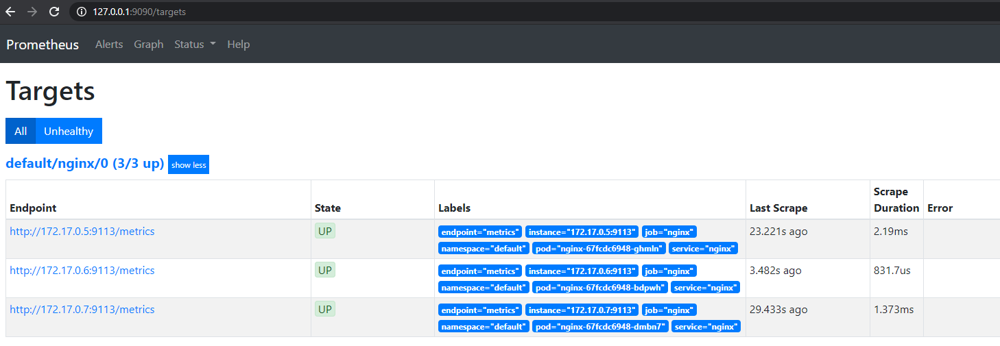

# Выполнено ДЗ № 8

 - [x] Основное ДЗ

## В процессе сделано:
Собран образ abvgdeej/monitorng_hm_nginx 
    
    docker build -t abvgdeej/monitorng_hm_nginx .
    docker push abvgdeej/monitorng_hm_nginx
    
Установлены CRD из репозитория https://github.com/prometheus-operator/prometheus-operator/tree/master/example/prometheus-operator-crd

    kubectl apply -f prometheus-operator-crd\
    customresourcedefinition.apiextensions.k8s.io/alertmanagerconfigs.monitoring.coreos.com created
    customresourcedefinition.apiextensions.k8s.io/alertmanagers.monitoring.coreos.com configured
    customresourcedefinition.apiextensions.k8s.io/podmonitors.monitoring.coreos.com configured
    customresourcedefinition.apiextensions.k8s.io/probes.monitoring.coreos.com created
    customresourcedefinition.apiextensions.k8s.io/prometheuses.monitoring.coreos.com configured
    customresourcedefinition.apiextensions.k8s.io/prometheusrules.monitoring.coreos.com configured
    customresourcedefinition.apiextensions.k8s.io/servicemonitors.monitoring.coreos.com configured
    customresourcedefinition.apiextensions.k8s.io/thanosrulers.monitoring.coreos.com created

Ссылки для инфо: 

    https://github.com/prometheus-operator/prometheus-operator#customresourcedefinitions
    https://habr.com/ru/company/mailru/blog/515138/

Указанный выше образ использован в Deployment, Service, ServiceMonitor:

    (kubectl apply -f deployment.yaml --validate) -and `
    (kubectl apply -f service.yaml --validate) -and `
    (kubectl apply -f servicemonitor.yaml --validate)

Создан namespace

    kubectl create namespace prometheus
    namespace/prometheus created

Установлен helm chart prometheus-operator

    helm upgrade --install prometheus stable/prometheus-operator --namespace=prometheus -f values.yaml
    
Пароль Grafana:

    kubectl get secret --namespace prometheus prometheus-grafana -o jsonpath="{.data.admin-password}"
    UXdlUnR5MSE= 

Пароль зашифрован в base64 - тот, что указан в values.yaml. Логин admin.

## Как запустить проект:
Проброс портов:
    
    kubectl port-forward service/prometheus-grafana -n prometheus 3000:80
    Forwarding from 127.0.0.1:3000 -> 3000
    Forwarding from [::1]:3000 -> 3000
    
    port-forward service/prometheus-prometheus-oper-prometheus -n prometheus 9090:9090
    Forwarding from 127.0.0.1:9090 -> 9090
    Forwarding from [::1]:9090 -> 9090

## Как проверить работоспособность:

http://127.0.0.1:3000 - Grafana

http://127.0.0.1:9090 - Prometheus

## PR checklist:
 - [x] Выставлен label с темой домашнего задания