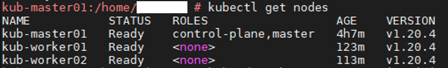

# Выполнено ДЗ № 14

- [x] Основное ДЗ
- [ ] Задание со *

## В процессе сделано:
Выполнена установка кластера последней версии на SUSE SLES 15 SP2 и составлена документация. Работа выполнялась до 
проведения лекции, ввиду чего обновление кластера не проводилось, и также не описано в данном readme.

По результатам пробного развертывания и ознакомления с лекцией, развертывание через kubeadm проводиться больше не будет,
а будет составлена новая инструкция по развертыванию CRI Containerd и кластера с помощью kubespray кластера с CNI Calico.

### SLES
Особенность установки Docker на SLES заключается в том, что Docker не будет корректно работать без установленного containers module.
Установить его можно либо во время установки из расширенного дистрибутива, либо после установки через yast, но потребуется 
регистрация (она платная). 

Поэтому, при установке чистой ОС, нужно выбрать basesystem, containers, development-tools modules, которые будут установлены вместе с ОС. 

Следующий момент, который уже важен для кубера - необходима разметка диска с ext4, на стандартной кубер не взлетит.

Дистрибутив качаем с официального сайта, образ SLE-15-SP2-Full-x86_64-GM-Media1.iso.

### Docker

    sudo -i
    zypper addrepo https://download.opensuse.org/repositories/Virtualization:containers/openSUSE_Leap_15.2/Virtualization:containers.repo
    zypper refresh
    zypper install docker

    systemctl enable docker.service
    systemctl start docker.service
    /usr/sbin/usermod -aG docker USERNAME
    su – USERNAME

Дополнительно:

    pip install docker-compose

### Установка Kubernetes

При раскатывании кубера с помощью kubeadm необходимо подготовить master ноду и worker ноды. Процесс отличается тем, что на мастере делается Init, а воркеры join'ятся к мастеру.
В данной статье приводится пример раскатывания мастера из конфигурации 1 master нода и 2 worker ноды. Т.к. ресурсов довольно мало, мы позволим мастеру использовать свои мощности для запуска подов, сервисов и прочих сущностей.

#### Процесс, необходимый к выполнению на всех нодах
На всех нодах нужно выполнить следующую последовательность:

    sudo -s
    
    cat <<EOF >> /etc/sysctl.conf
    net.ipv4.ip_forward=1
    net.ipv4.conf.all.forwarding=1
    net.bridge.bridge-nf-call-iptables=1
    EOF
    
    cat <<EOF > /etc/zypp/repos.d/google-k8s.repo
    [google-k8s]
    name=google-k8s
    enabled=1
    autorefresh=1
    baseurl=https://packages.cloud.google.com/yum/repos/kubernetes-el7-x86_64
    type=rpm-md
    gpgcheck=1
    repo_gpgcheck=1
    pkg_gpgcheck=1
    EOF

импорт Google repository keys

    rpm --import https://packages.cloud.google.com/yum/doc/rpm-package-key.gpg
    rpm --import https://packages.cloud.google.com/yum/doc/yum-key.gpg
    rpm -q gpg-pubkey --qf '%{name}-%{version}-%{release} --> %{summary}\n'

добавить conntrack репозиторий, обновить и установить требуемые conntrack-tools; t - доверяем

    zypper addrepo https://download.opensuse.org/repositories/security:netfilter/SLE_12/ conntrack
    zypper refresh conntrack
    zypper install conntrack-tools

refresh Google repository

    zypper refresh google-k8s

установка последнего доступного kubelet. Если не нужен последний, смотрим zypper packages --repo google-k8s и выбираем версию
ignore conntrack dependency and install kubelet (Solution 2 in my case) Возникнет ошибка, игнорируем conntrack (2):

    zypper install kubelet

Установка kubeadm пакета. kubectl и cri-tools установятся как kubeadm dependency

    zypper install kubeadm

Заставляем докер использовать драйвер cgroup systemd и драйвер хранилища overlay2.
kubelet может работать и с содержимым файла по умолчанию, но лучше изменить.

    cat > /etc/docker/daemon.json <<EOF
    {
        "exec-opts": ["native.cgroupdriver=systemd"],
        "log-driver": "json-file",
        "log-opts": {
            "max-size": "100m"
        },
        "storage-driver": "overlay2"
    }
    EOF

    mkdir -p /etc/systemd/system/docker.service.d

рестарт докер сервиса, включение kubelet

    systemctl stop docker.service
    systemctl start docker.service
    systemctl enable kubelet.service

Принять сконфигурированный ранее sysctl
net.bridge.bridge-nf-call-iptables станет доступным после перезапуска докер сервиса

    sysctl -p

отключить подкачку (еще можно закомментировать соответствующую строку, но у меня и без этого заработало)
    
    swapoff -a

#### Подготовка master

На мастер ноде делаем init:

    kubeadm init --pod-network-cidr=10.244.0.0/16

Скопировать конфигурацию kubectl для подключения к кластеру на доверенный non-root аккаунт

    mkdir -p $HOME/.kube
    sudo cp -i /etc/kubernetes/admin.conf $HOME/.kube/config
    sudo chown $(id -u):$(id -g) $HOME/.kube/config

вывод init команды вида
    
    kubeadm join MASTER-NODE-IP:6443 --token ТОКЕН --discovery-token-ca-cert-hash sha256:ХЭШ

лучше сохранить. Если вывод утерян, то воспользоваться командой:
    
    kubeadm token create --print-join-command

Задеплоить Flannel network addon
если посмотреть в данный манифест, обнаружим подсеть 10.244.0.0/16

    kubectl apply -f https://raw.githubusercontent.com/coreos/flannel/master/Documentation/kube-flannel.yml

удалить taint с мастер ноды. Так как в тестовом кластере у нас всего три ноды и ресурсы ограничены, позволим мастеру использовать свои ресурсы

    kubectl taint nodes --all node-role.kubernetes.io/master-

Проверяем, что нода доступна:

    kubectl get nodes

Раскатанные поды (уже с воркерами - статья написана после установки кластера)

#### Join worker nodes

Осталось заджойнить воркер ноды, для этого используем команду kubeadm join из вывода init команды:

    kubeadm join MASTER-NODE-IP:6443 --token ТОКЕН --discovery-token-ca-cert-hash sha256:ХЭШ
    
    [preflight] Running pre-flight checks
    [preflight] Reading configuration from the cluster...
    [preflight] FYI: You can look at this config file with 'kubectl -n kube-system get cm kubeadm-config -o yaml'
    [kubelet-start] Writing kubelet configuration to file "/var/lib/kubelet/config.yaml"
    [kubelet-start] Writing kubelet environment file with flags to file "/var/lib/kubelet/kubeadm-flags.env"
    [kubelet-start] Starting the kubelet
    [kubelet-start] Waiting for the kubelet to perform the TLS Bootstrap...

    This node has joined the cluster:
    * Certificate signing request was sent to apiserver and a response was received.
    * The Kubelet was informed of the new secure connection details.
    
    Run 'kubectl get nodes' on the control-plane to see this node join the cluster.

Повторяем ту же команду на всех нодах, выполняем проверку подключения на мастер ноде:

Если что-то пошло не так, выполняем:
    
    kubectl describe node kub-worker01

общий синтаксис команды:

    kubectl describe РЕСУРС (node/pod/service etc) ИМЯ РЕСУРСА

нас интересует блок Events

выполняем еще раз просмотр подов

    kubectl get pods -A -o -wide

### MetalLB
В отличие от cloud managed-кластеров, на bare metal нужен свой network load balancer, который будет мапить internal ip LoadBalancer / Ingress
на External IP назначенного диапазона. Для этого существует MetalLB, его необходимо установить:

Подробнее см. https://kubernetes.github.io/ingress-nginx/deploy/baremetal/,
https://metallb.universe.tf/installation/, https://habr.com/ru/company/southbridge/blog/443110/

#### Подготовка:

Необходимо внести измения в конфигурацию конфигмапы кластера. Для этого можно выполнить

    kubectl edit configmap -n kube-system kube-proxy

откроется файл для изменения. Необходимо найти в файле "kube-proxy" строку "mode", изменить значение "mode" с пустого на "ipvs" и добавить "strictARP: true" и сохранить изменения.

_Примечание: в официальной документации по установке говорится, что можно в конец файла конфига добавить
разделитель "---" и со следующей строки прописать:_

    apiVersion: kubeproxy.config.k8s.io/v1alpha1
    kind: KubeProxyConfiguration
    mode: "ipvs"
    ipvs:
        strictARP: true

данная возможность не проверялась.

Далее нужно удалить Pod с kube-proxy, чтобы применить новую конфигурацию (он входит в DaemonSet и будет запущен автоматически)

    kubectl --namespace kube-system delete pod --selector='k8s-app=kube-proxy'

#### Установка
В манифест metallb-config.yml нужно указать список ip адресов, которые будут использоваться в качестве EXTERNAL-IP.

    kubectl apply -f metallb-ns.yml
    kubectl apply -f metallb.yml
    kubectl apply -f metallb-config.yml
    kubectl create secret generic -n metallb-system memberlist --from-literal=secretkey="$(openssl rand -base64 128)"

## Как запустить проект:
Выполнить описанные выше шаги, но работают далеко не все поды и ингрессы.

## Как проверить работоспособность:

    kubectl get nodes
    kubectl get ns
    kubectl get pods

## PR checklist:
- [x] Выставлен label с темой домашнего задания